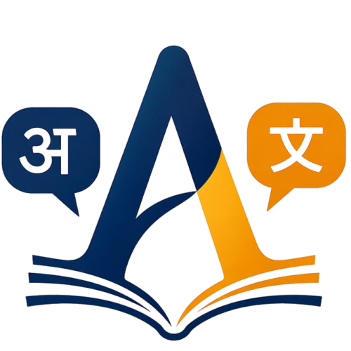

# 📝 Anuvad – Desktop Translation Workbench

<center>

</center>

**Anuvad** is a PyQt5-based desktop application designed for structured text translation workflows. It allows users to break down large text files into manageable segments, translate them efficiently, and track progress—all within a clean, professional UI.

---

## 🚀 Features

### 📂 Project Management

- Start a **new project** by uploading a `.txt` file
- Resume existing work from `.abd` files
- All data stored in a dedicated `data/` directory

### 🧩 Structured Translation Workflow

- Automatically parses text into numbered segments:

    ```text
    #1
    D R A C U L A

    #2
    CHAPTER I
    ```

- Navigate segment-by-segment or via list view

### 🖥️ Modern UI

- Split editor (Source | Translation) using resizable panels
- Two-column list view for quick overview
- Clean typography and spacing
- Double-click navigation

### 🌍 Multi-Language Support

- Auto-detect source language
- Select target language dynamically
- Supports multiple languages (extensible)

### ⚡ Auto Translation

- Integrated with LibreTranslate (Argos endpoint)
- One-click translation per segment
- Batch-ready architecture

### 📊 Progress Tracking

- View completion percentage
- Track translated vs pending segments

### 💾 Custom File Format (`.abd`)

- Stores both content and metadata:

    ```text
    # --- ANUVAD METADATA ---
    name: dracula
    author: Purbayan
    role: source
    language: en
    # --- END METADATA ---
    ```

- Reliable and extensible (no fragile filename parsing)

### ⚙️ Configurable via `app.cfg`

- Customize:
    - Data directory
    - Default languages
    - UI font
    - API endpoint

---

## 📁 Project Structure

```
anuvad/
│
├── main.py
├── app.cfg
│
├── core/
│   ├── parser.py
│   ├── file_handler.py
│   ├── language.py
│   ├── translator.py
│   ├── config.py
│
├── models/
│   ├── translation_model.py
│
├── ui/
│   ├── main_window.py
│   ├── upload_screen.py
│   ├── list_screen.py
│   ├── editor_screen.py
│
└── data/
```

---

## ⚙️ Installation

### 1. Clone the repository

```bash
git clone <repo-url>
cd anuvad
```

### 2. Create virtual environment (recommended)

```bash
python -m venv .venv
source .venv/bin/activate   # Linux/Mac
.venv\Scripts\activate      # Windows
```

### 3. Install dependencies

```bash
pip install PyQt5 requests langdetect
```

---

## ▶️ Running the App

```bash
python main.py
```

---

## 🧠 How It Works

1. Upload a text file
2. App parses into structured segments
3. Segments displayed in list view
4. Translate manually or auto-translate
5. Save progress in `.abd` format
6. Resume anytime

---

## 📌 Future Improvements

- 🔄 Non-blocking translation (QThread)
- 📊 Live progress bar
- 📑 Multi-language parallel translation
- 💾 Auto-save + versioning
- 🌙 Dark theme
- 📦 Export to JSON/CSV

---

## ⚠️ Known Limitations

- Auto translation is currently synchronous (UI may briefly freeze)
- Public API may be rate-limited
- Language detection may fail on very short text

---

## 👨‍💻 Author

**Purbayan Chowdhury**

---

## 📜 License

MIT License (or choose your preferred license)

---

## 💡 Philosophy

Anuvad is built as a **translator’s tool**, not just a translator—
focused on **control, structure, and workflow**, not blind automation.
